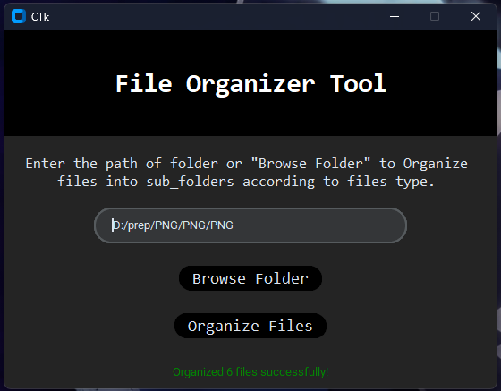

# PP_2-Installer-File_Organizer-Filorganizer-_GUI-Based
Personal Project 2 :A simple GUI-based file organizer built using Python and [CustomTkinter](https://github.com/TomSchimansky/CustomTkinter). This tool allows users to organize files in a selected folder into subfolders based on their file extensions.
#  File Organizer Tool

A simple GUI-based file organizer built using Python and [CustomTkinter](https://github.com/TomSchimansky/CustomTkinter). This tool allows users to organize files in a selected folder into subfolders based on their file extensions.

---

##  Features

- Modern and clean CustomTkinter GUI
- Organizes files into subfolders by file type (e.g., `.pdf`, `.jpg`, `.txt`, etc.)
- Browse folders using a built-in dialog
- Status feedback on operation success
- Works with PyInstaller for creating standalone executables
- Icon customization support

---

##  Getting Started

### Prerequisites

Make sure you have Python 3.7+ installed.

Install required Python libraries:
```bash
pip install customtkinter

##  Application Preview


